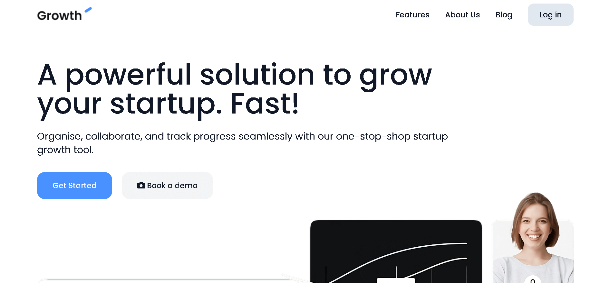
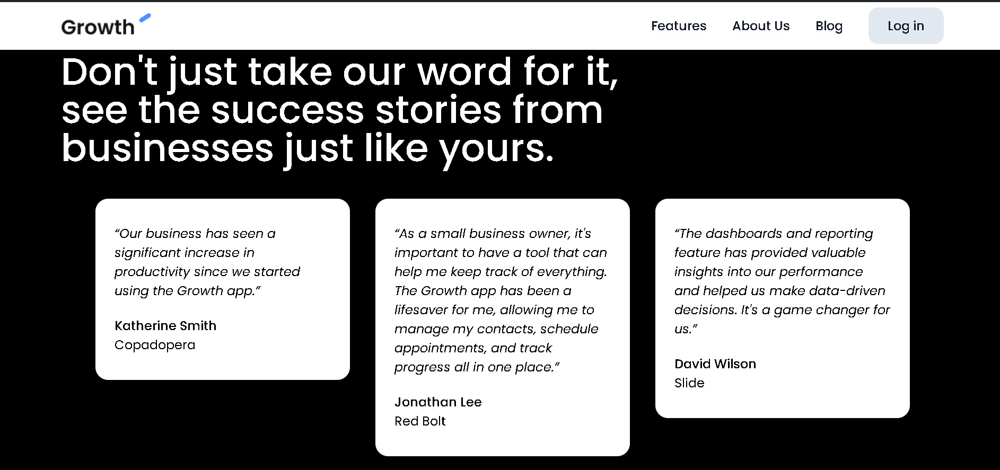
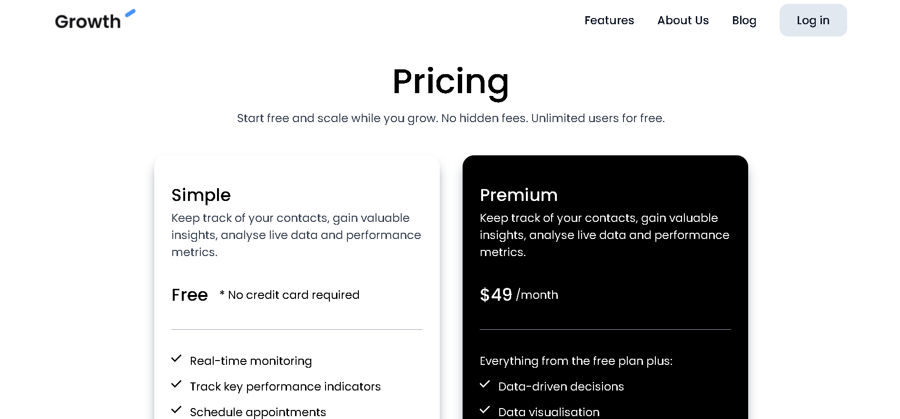

# Tailwind Landing Page

Este proyecto es una landing page desarrollada como mi primer ejercicio práctico utilizando Tailwind CSS. Como parte de mi proceso de aprendizaje, he decidido explorar y aprovechar las ventajas de esta tecnología para crear interfaces web modernas y eficientes. Para este proyecto, he tomado como referencia una plantilla de la comunidad de Figma, lo que me permitió centrarme en la implementación y personalización del diseño con Tailwind.

[Template](https://www.figma.com/community/file/1197208898905921722/free-landing-page-desktop-mobile-vc)

## Demo

[Demo](https://growthtailwind.vercel.app)

## Capturas de Pantalla

## Tecnologías Empleadas

**Frontend:** HTML, CSS, Tailwind CSS y Javascript
